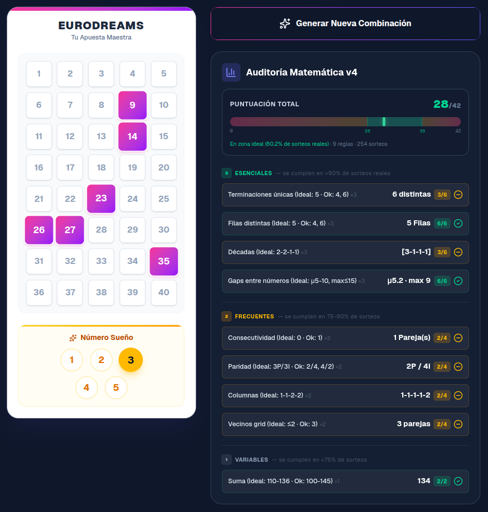

# 🎯 Generador Estadístico EuroDreams



## Motivación

Este proyecto nace de la curiosidad de un aficionado a los números y la estadística, **no al juego en sí**. La pregunta de partida es sencilla: si analizamos los resultados históricos de un sorteo como EuroDreams, ¿podemos identificar patrones de dispersión y equilibrio que se repiten con más frecuencia? Este generador es un ejercicio de análisis numérico y programación, no una herramienta de predicción.

No tengo estudios en matemáticas ni estadística, solo curiosidad por los números, por lo que este proyecto nace como divertimiento de un sábado por la mañana de incertidumbre y aburrimiento. Así que si ves algo que no tiene sentido, cosa más que probable según los [estudios de los galardonados premios Ig Nobel de Psicología Kruger, J. y Dunning, D. sobre la audacia de la incompetencia](https://psycnet.apa.org/doiLanding?doi=10.1037%2F0022-3514.77.6.1121), no dudes en no exasperarte y seguir con tu vida 😊

También puedes colaborar en el proyecto si lo deseas. No dudes en abrir un issue o enviar un pull request para convertir este proyecto en un monstruo completamente sin sentido. Cualquier propuesta será validada por algún modelo de IA ocioso.

## El Algoritmo: 9 Reglas Ponderadas por Frecuencia Histórica

El motor estadístico ("Frankenstein v4") evalúa cada combinación según **9 reglas calibradas empíricamente**. Cada regla otorga 0, 1 o 2 puntos base, multiplicados por un **peso** según la frecuencia de cumplimiento histórico.

### 🟢 Esenciales (×3) — se cumplen en >90% de sorteos reales

| # | Regla | Ideal (2 pts) | Aceptable (1 pt) | Cumplimiento histórico |
|---|---|---|---|---|
| 1 | **Terminaciones** | 5 dígitos finales únicos | 4 ó 6 | **97.2%** |
| 2 | **Filas** | Exactamente 5 | 4 ó 6 | **93.7%** |
| 3 | **Décadas** | Patrón [2-2-1-1] | [3-2-1-0], [3-1-1-1], [2-2-2-0] | **90.5%** |
| 4 | **Gaps** | μ 5–10, max ≤ 15 | μ 4–12, max ≤ 20 | **~90%** |

### 🟡 Frecuentes (×2) — se cumplen en 75-90% de sorteos

| # | Regla | Ideal (2 pts) | Aceptable (1 pt) | Cumplimiento histórico |
|---|---|---|---|---|
| 5 | **Consecutividad** | 0 parejas consecutivas | 1 pareja | **87.4%** |
| 6 | **Paridad** | 3 pares / 3 impares | 2/4 ó 4/2 | **79.9%** |
| 7 | **Columnas** | Patrón [1-1-2-2] | [1-2-3], [1-1-1-1-2] | **75.6%** |
| 8 | **Vecinos grid** | ≤ 2 parejas adyacentes | 3 parejas | **79.9%** |

### ⚪ Variables (×1) — se cumplen en <75% de sorteos

| # | Regla | Ideal (2 pts) | Aceptable (1 pt) | Cumplimiento histórico |
|---|---|---|---|---|
| 9 | **Suma** | 110–136 | 100–145 | **~65%** |

**Puntuación máxima ponderada: 42** (4 reglas ×3 ×2pts + 4 reglas ×2 ×2pts + 1 regla ×1 ×2pts).

### Filosofía: zona realista, no sobreajuste

El análisis histórico revela que los sorteos reales puntúan en una campana centrada en **28-30/42**. Solo el ~1% de sorteos reales alcanza la puntuación máxima. 

En vez de maximizar el score (sobreajuste), el generador **busca combinaciones en la zona central [25-35]** — el rango donde cae el ~60% de sorteos reales. Esto produce combinaciones estadísticamente coherentes sin reducir artificialmente el espacio de candidatos.

Además, el motor usa **generación ponderada**: los números infrarrepresentados en el histórico reciben una probabilidad ligeramente mayor (regresión suave a la media).

## Fundamentos Estadísticos

El algoritmo se apoya en los siguientes principios y leyes estadísticas:

| Principio | Aplicación en el algoritmo |
|---|---|
| [**Ley de los Grandes Números**](https://es.wikipedia.org/wiki/Ley_de_los_grandes_n%C3%BAmeros) | A medida que crece el número de sorteos, las frecuencias observadas convergen a las probabilidades teóricas. Es la base para usar el histórico como referencia fiable |
| [**Regresión a la Media**](https://es.wikipedia.org/wiki/Regresi%C3%B3n_a_la_media) | Los números infrarrepresentados recibirán más peso en la generación, asumiendo que tenderán a equilibrarse. Fórmula: `peso = (freq_esperada / freq_real)^0.5` |
| [**Teorema Central del Límite**](https://es.wikipedia.org/wiki/Teorema_del_l%C3%ADmite_central) | La suma de 6 números aleatorios sigue una distribución aproximadamente normal (campana), lo que justifica el rango ideal [110-136] centrado en la media ~123 |
| [**Distribución Uniforme Discreta**](https://es.wikipedia.org/wiki/Distribuci%C3%B3n_uniforme_discreta) | Punto de partida teórico: en un sorteo justo, cada número tiene probabilidad 1/40. Las desviaciones observadas son la materia prima del análisis |
| [**Análisis de Clustering Espacial**](https://en.wikipedia.org/wiki/Spatial_analysis#Spatial_cluster_analysis) | Las reglas de vecinos en grid y dispersión por filas/columnas evalúan la dispersión bidimensional de los números en el boleto físico |
| [**Prueba Chi-cuadrado**](https://es.wikipedia.org/wiki/Prueba_%CF%87%C2%B2) | Inspiración para comparar distribuciones observadas (patrones de décadas, paridad, terminaciones) contra las distribuciones esperadas por azar |

## Validación del algoritmo

El script `analyze_history.js` valida las 9 reglas contra los sorteos históricos reales. Requiere el servidor en ejecución (`npm run dev`):

```bash
$ node analyze_history.js
```

<details open>
<summary>📊 Ejemplo de salida (254 sorteos — abril 2026)</summary>

```
Obteniendo datos desde la API...
Total sorteos analizados: 254

=== REGLA 1: SUMA ===
Media: 122.8 | Min: 48 | Max: 185
En rango [110-136]: 102/254 (40.2%)
Distribucion:
  100-109: 23 (9.1%)
  110-119: 35 (13.8%)
  120-129: 36 (14.2%)
  130-139: 43 (16.9%)
  140-149: 28 (11.0%)
  150-159: 21 (8.3%)
  160-169: 8 (3.1%)
  170-179: 7 (2.8%)
  180-189: 2 (0.8%)
  40-49: 1 (0.4%)
  50-59: 1 (0.4%)
  60-69: 6 (2.4%)
  70-79: 6 (2.4%)
  80-89: 14 (5.5%)
  90-99: 23 (9.1%)
P10=87 P25=105 P50=125 P75=140 P90=154

=== REGLA 2: PARIDAD ===
  3P/3I: 98 (38.6%)
  2P/4I: 58 (22.8%)
  4P/2I: 47 (18.5%)
  5P/1I: 24 (9.4%)
  1P/5I: 22 (8.7%)
  0P/6I: 3 (1.2%)
  6P/0I: 2 (0.8%)

=== REGLA 3: DÉCADAS [1-10][11-20][21-30][31-40] ===
  [2-2-1-1]: 91 (35.8%)
  [3-2-1-0]: 83 (32.7%)
  [3-1-1-1]: 31 (12.2%)
  [2-2-2-0]: 25 (9.8%)
  [4-1-1-0]: 10 (3.9%)
  [4-2-0-0]: 7 (2.8%)
  [3-3-0-0]: 5 (2.0%)
  [5-1-0-0]: 2 (0.8%)

=== REGLA 4: PAREJAS CONSECUTIVAS ===
  0 pareja(s): 114 (44.9%)
  1 pareja(s): 108 (42.5%)
  2 pareja(s): 30 (11.8%)
  3 pareja(s): 2 (0.8%)

=== REGLA 5: TERMINACIONES ÚNICAS ===
  3 terminaciones: 7 (2.8%)
  4 terminaciones: 64 (25.2%)
  5 terminaciones: 130 (51.2%)
  6 terminaciones: 53 (20.9%)

=== REGLA 6: PATRÓN COLUMNAS ===
  [1-1-2-2]: 112 (44.1%)
  [1-2-3]: 46 (18.1%)
  [1-1-1-3]: 34 (13.4%)
  [1-1-1-1-2]: 34 (13.4%)
  [2-2-2]: 11 (4.3%)
  [1-1-4]: 11 (4.3%)
  [2-4]: 3 (1.2%)
  [3-3]: 2 (0.8%)
  [1-5]: 1 (0.4%)

=== REGLA 7: FILAS DISTINTAS ===
  2 filas: 1 (0.4%)
  3 filas: 15 (5.9%)
  4 filas: 78 (30.7%)
  5 filas: 131 (51.6%)
  6 filas: 29 (11.4%)

=== REGLA 8: GAPS ENTRE NÚMEROS ===
Gap medio — Media: 5.82 | Gap máximo — Media: 12.61
Ideal (mean 5-10, max ≤15): 148/254 (58.3%)

=== REGLA 9: VECINOS GRID 8×5 ===
  0 parejas: 18 (7.1%)
  1 parejas: 48 (18.9%)
  2 parejas: 88 (34.6%)
  3 parejas: 49 (19.3%)
  4 parejas: 27 (10.6%)
  5 parejas: 18 (7.1%)
  6 parejas: 3 (1.2%)
  7 parejas: 2 (0.8%)
  9 parejas: 1 (0.4%)

=== NÚMERO SUEÑO ===
  Sueño 1: 58 (22.8%)
  Sueño 2: 44 (17.3%)
  Sueño 3: 56 (22.0%)
  Sueño 4: 47 (18.5%)
  Sueño 5: 49 (19.3%)

=== FRECUENCIA (media esperada: 38.1) ===
Top 10 calientes:
  N 8: 50
  N23: 50
  N19: 48
  N21: 48
  N37: 48
  N15: 47
  N24: 47
  N 3: 43
  N30: 42
  N33: 42
Top 10 fríos:
  N16: 34
  N20: 34
  N31: 34
  N39: 34
  N 6: 33
  N17: 33
  N40: 33
  N12: 28
  N29: 27
  N36: 27

=== GAPS (sorteos desde última aparición) ===
Más fríos:
  N31: 25 sorteos
  N40: 23 sorteos
  N27: 16 sorteos
  N10: 14 sorteos
  N12: 13 sorteos
  N25: 13 sorteos
  N26: 13 sorteos
  N18: 10 sorteos
  N22: 10 sorteos
  N38: 10 sorteos
Más calientes:
  N 2: 1 sorteos
  N14: 1 sorteos
  N28: 1 sorteos
  N33: 1 sorteos
  N 3: 0 sorteos
  N 7: 0 sorteos
  N 8: 0 sorteos
  N19: 0 sorteos
  N24: 0 sorteos
  N29: 0 sorteos

=== PUNTUACIÓN GLOBAL v4 (9 reglas ponderadas, max 42) ===
  8/42: 1 sorteos (0.4%)
  11/42: 1 sorteos (0.4%)
  12/42: 1 sorteos (0.4%)
  13/42: 2 sorteos (0.8%)
  14/42: 4 sorteos (1.6%)
  15/42: 3 sorteos (1.2%)
  16/42: 5 sorteos (2.0%)
  17/42: 5 sorteos (2.0%)
  18/42: 1 sorteos (0.4%)
  19/42: 9 sorteos (3.5%)
  20/42: 5 sorteos (2.0%)
  21/42: 1 sorteos (0.4%)
  22/42: 12 sorteos (4.7%)
  23/42: 7 sorteos (2.8%)
  24/42: 7 sorteos (2.8%)
  25/42: 12 sorteos (4.7%)
  26/42: 16 sorteos (6.3%)
  27/42: 13 sorteos (5.1%)
  28/42: 17 sorteos (6.7%)
  29/42: 12 sorteos (4.7%)
  30/42: 16 sorteos (6.3%)
  31/42: 18 sorteos (7.1%)
  32/42: 12 sorteos (4.7%)
  33/42: 19 sorteos (7.5%)
  34/42: 11 sorteos (4.3%)
  35/42: 13 sorteos (5.1%)
  36/42: 5 sorteos (2.0%)
  37/42: 5 sorteos (2.0%)
  38/42: 9 sorteos (3.5%)
  39/42: 4 sorteos (1.6%)
  40/42: 5 sorteos (2.0%)
  41/42: 2 sorteos (0.8%)
  42/42: 1 sorteos (0.4%)
```

</details>

## Fuente de datos

Los datos históricos de sorteos se obtienen en tiempo real desde la web de [Lotoideas](https://www.lotoideas.com/eurodreams-resultados-historicos-de-todos-los-sorteos/). Agradecemos a su creador la recopilación y publicación de estos resultados de forma abierta.

## ⚠️ Juego Responsable

**El juego puede crear adicción.** Este generador no incrementa las posibilidades de ganar en ningún sorteo. Los resultados de cualquier lotería son **puramente aleatorios** y ningún análisis estadístico puede predecir el resultado de un sorteo futuro. Si decides jugar, hazlo siempre con moderación y dentro de tus posibilidades. Si lo necesitas, [PIDE AYUDA](https://pnsd.sanidad.gob.es/ciudadanos/informacion/otrasAdicciones/home.htm).

## Disclaimer

> Este proyecto es un **ejercicio realizado meramente por diversión** y con fines educativos. Se proporciona **"AS IS"** (tal cual), sin garantías de ningún tipo, expresas o implícitas. Los autores no se hacen responsables de ningún uso que se haga de esta herramienta. Publicado bajo la licencia más permisiva posible (Unlicense / dominio público).

## Créditos

- **Idea y concepto:** Luismi Sánchez
- **Código:** Claude Opus 4.6 (Anthropic)

---

## Tech stack

This is a [Next.js](https://nextjs.org) project bootstrapped with [`create-next-app`](https://nextjs.org/docs/app/api-reference/cli/create-next-app).

## Getting Started

First, run the development server:

```bash
npm run dev
# or
yarn dev
# or
pnpm dev
# or
bun dev
```

Open [http://localhost:3000](http://localhost:3000) with your browser to see the result.

You can start editing the page by modifying `app/page.tsx`. The page auto-updates as you edit the file.

This project uses [`next/font`](https://nextjs.org/docs/app/building-your-application/optimizing/fonts) to automatically optimize and load [Geist](https://vercel.com/font), a new font family for Vercel.

## Learn More

To learn more about Next.js, take a look at the following resources:

- [Next.js Documentation](https://nextjs.org/docs) - learn about Next.js features and API.
- [Learn Next.js](https://nextjs.org/learn) - an interactive Next.js tutorial.

You can check out [the Next.js GitHub repository](https://github.com/vercel/next.js) - your feedback and contributions are welcome!

## Deploy on Vercel

The easiest way to deploy your Next.js app is to use the [Vercel Platform](https://vercel.com/new?utm_medium=default-template&filter=next.js&utm_source=create-next-app&utm_campaign=create-next-app-readme) from the creators of Next.js.

Check out our [Next.js deployment documentation](https://nextjs.org/docs/app/building-your-application/deploying) for more details.
